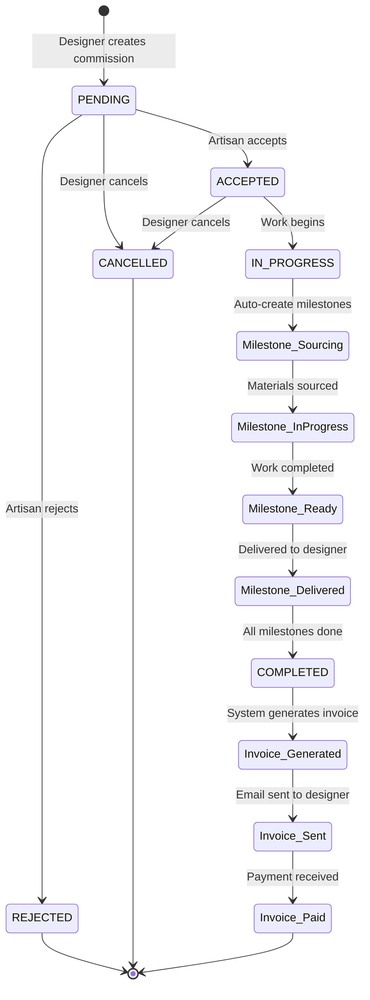

# CraftersLink - Architecture & Project Blueprint

## Executive Summary
CraftersLink is a web-based marketplace connecting Kenyan interior designers with local artisans. Built for a 48-hour hackathon, this platform demonstrates professional workflow management: discovery, commission tracking, KES-denominated invoicing, and milestone-based project delivery.

**Tech Stack:**
- Frontend: React + TypeScript + IBM Carbon Design System
- Backend: Django REST Framework + PostgreSQL
- Storage: IBM Cloud Object Storage
- Auth: Django JWT (djangorestframework-simplejwt)
- Deployment: Docker + docker-compose (local demo ready)

---

## 1. Monorepo Folder Structure

```
CraftersLink/
├── frontend/                    # React + TypeScript + Carbon Design
│   ├── public/
│   ├── src/
│   │   ├── components/         # Reusable Carbon components
│   │   │   ├── common/        # Buttons, Cards, Modals
│   │   │   ├── artisan/       # ArtisanCard, ProductGallery
│   │   │   ├── designer/      # CommissionForm, MilestoneTracker
│   │   │   └── shared/        # Header, Footer, Navigation
│   │   ├── pages/             # Route-level components
│   │   │   ├── Home.tsx
│   │   │   ├── ArtisanCatalogue.tsx
│   │   │   ├── ProductDetail.tsx
│   │   │   ├── CommissionFlow.tsx
│   │   │   ├── Dashboard.tsx
│   │   │   └── InvoiceView.tsx
│   │   ├── services/          # API client services
│   │   │   ├── api.ts         # Axios instance with JWT interceptor
│   │   │   ├── auth.service.ts
│   │   │   ├── product.service.ts
│   │   │   ├── commission.service.ts
│   │   │   └── invoice.service.ts
│   │   ├── hooks/             # Custom React hooks
│   │   ├── context/           # Auth & App state context
│   │   ├── types/             # TypeScript interfaces
│   │   ├── utils/             # Helper functions
│   │   ├── App.tsx
│   │   └── index.tsx
│   ├── package.json
│   ├── tsconfig.json
│   └── Dockerfile
│
├── backend/                     # Django REST Framework
│   ├── crafterslink/           # Django project root
│   │   ├── settings.py
│   │   ├── urls.py
│   │   └── wsgi.py
│   ├── apps/
│   │   ├── users/             # Custom user model & auth
│   │   │   ├── models.py      # User, UserProfile
│   │   │   ├── serializers.py
│   │   │   ├── views.py
│   │   │   └── urls.py
│   │   ├── artisans/          # Artisan profiles & products
│   │   │   ├── models.py      # ArtisanProfile, Product
│   │   │   ├── serializers.py
│   │   │   ├── views.py
│   │   │   ├── filters.py     # Django-filter for search
│   │   │   └── urls.py
│   │   ├── commissions/       # Commission workflow
│   │   │   ├── models.py      # Commission, Milestone
│   │   │   ├── serializers.py
│   │   │   ├── views.py
│   │   │   ├── signals.py     # Auto-create milestones
│   │   │   └── urls.py
│   │   └── invoices/          # Invoice generation
│   │       ├── models.py      # Invoice
│   │       ├── serializers.py
│   │       ├── views.py
│   │       ├── pdf_generator.py  # ReportLab PDF generation
│   │       └── urls.py
│   ├── media/                 # Local file uploads (dev)
│   ├── static/
│   ├── requirements.txt
│   ├── manage.py
│   └── Dockerfile
│
├── deploy/                      # Deployment configurations
│   ├── docker-compose.yml      # Multi-container orchestration
│   ├── docker-compose.prod.yml # Production overrides
│   ├── nginx/                  # Nginx reverse proxy config
│   │   └── nginx.conf
│   ├── postgres/               # PostgreSQL init scripts
│   │   └── init.sql
│   └── ibm-cloud/              # IBM Cloud deployment (future)
│       ├── manifest.yml        # Cloud Foundry manifest
│       └── kubernetes/         # K8s manifests (optional)
│
├── docs/                        # Documentation
│   ├── ARCHITECTURE.md         # This file
│   ├── API_SPECIFICATION.md    # REST API documentation
│   ├── DATA_MODELS.md          # Database schema details
│   ├── DEPLOYMENT.md           # Deployment instructions
│   └── diagrams/               # Mermaid diagrams
│       ├── data-model.md
│       ├── api-flow.md
│       └── commission-workflow.md
│
├── bob-report/                  # IBM Bob session exports
│   ├── plan-mode-sessions/
│   ├── code-mode-sessions/
│   ├── ask-mode-sessions/
│   └── SDLC_REPORT.md          # Summary of Bob usage
│
├── .gitignore
├── README.md
└── LICENSE
```

---

## 2. Detailed Data Models

### 2.1 User Model (Custom Django User)

```python
# apps/users/models.py

from django.contrib.auth.models import AbstractUser
from django.db import models

class User(AbstractUser):
    """Custom user model supporting ARTISAN and DESIGNER roles"""
    
    class UserRole(models.TextChoices):
        ARTISAN = 'ARTISAN', 'Artisan'
        DESIGNER = 'DESIGNER', 'Interior Designer'
    
    role = models.CharField(
        max_length=10,
        choices=UserRole.choices,
        default=UserRole.DESIGNER
    )
    phone_number = models.CharField(max_length=15, blank=True)
    profile_image = models.URLField(blank=True, null=True)  # IBM COS URL
    is_verified = models.BooleanField(default=False)
    created_at = models.DateTimeField(auto_now_add=True)
    updated_at = models.DateTimeField(auto_now=True)
    
    class Meta:
        db_table = 'users'
        indexes = [
            models.Index(fields=['role', 'is_verified']),
            models.Index(fields=['email']),
        ]
```

### 2.2 ArtisanProfile Model

```python
# apps/artisans/models.py

from django.db import models
from apps.users.models import User

class ArtisanProfile(models.Model):
    """Extended profile for artisan users"""
    
    # Kenyan Counties for location
    COUNTY_CHOICES = [
        ('NAIROBI', 'Nairobi'),
        ('MOMBASA', 'Mombasa'),
        ('KISUMU', 'Kisumu'),
        ('NAKURU', 'Nakuru'),
        ('KIAMBU', 'Kiambu'),
        ('KISII', 'Kisii'),
        ('LAMU', 'Lamu'),
        ('KAJIADO', 'Kajiado'),
        ('MACHAKOS', 'Machakos'),
        ('KILIFI', 'Kilifi'),
        # Add all 47 counties as needed
    ]
    
    CRAFT_SPECIALTIES = [
        ('SOAPSTONE', 'Kisii Soapstone Carving'),
        ('FURNITURE', 'Lamu Furniture'),
        ('BEADWORK', 'Maasai Beadwork'),
        ('BASKETS', 'Woven Baskets'),
        ('POTTERY', 'Pottery & Ceramics'),
        ('TEXTILES', 'Traditional Textiles'),
        ('WOODCARVING', 'Wood Carving'),
        ('METALWORK', 'Metal Crafts'),
        ('JEWELRY', 'Handmade Jewelry'),
    ]
    
    user = models.OneToOneField(
        User,
        on_delete=models.CASCADE,
        related_name='artisan_profile'
    )
    bio = models.TextField(max_length=1000)
    county = models.CharField(max_length=50, choices=COUNTY_CHOICES)
    town = models.CharField(max_length=100)
    craft_specialty = models.CharField(max_length=50, choices=CRAFT_SPECIALTIES)
    years_of_experience = models.PositiveIntegerField(default=0)
    workshop_address = models.TextField(blank=True)
    
    # Business details
    business_name = models.CharField(max_length=200, blank=True)
    business_registration = models.CharField(max_length=100, blank=True)
    
    # Portfolio
    portfolio_images = models.JSONField(default=list)  # List of IBM COS URLs
    
    # Ratings
    average_rating = models.DecimalField(
        max_digits=3,
        decimal_places=2,
        default=0.00
    )
    total_commissions = models.PositiveIntegerField(default=0)
    
    created_at = models.DateTimeField(auto_now_add=True)
    updated_at = models.DateTimeField(auto_now=True)
    
    class Meta:
        db_table = 'artisan_profiles'
        indexes = [
            models.Index(fields=['county', 'craft_specialty']),
            models.Index(fields=['average_rating']),
        ]
    
    def __str__(self):
        return f"{self.user.get_full_name()} - {self.craft_specialty}"
```

### 2.3 Product Model

```python
# apps/artisans/models.py (continued)

class Product(models.Model):
    """Artisan products - both in-stock and commissionable"""
    
    class ProductStatus(models.TextChoices):
        IN_STOCK = 'IN_STOCK', 'In Stock'
        COMMISSIONABLE = 'COMMISSIONABLE', 'Available for Commission'
        SOLD = 'SOLD', 'Sold'
        ARCHIVED = 'ARCHIVED', 'Archived'
    
    artisan = models.ForeignKey(
        ArtisanProfile,
        on_delete=models.CASCADE,
        related_name='products'
    )
    name = models.CharField(max_length=200)
    description = models.TextField()
    material = models.CharField(max_length=100)  # e.g., "Soapstone", "Mahogany Wood"
    
    # Dimensions
    length_cm = models.DecimalField(max_digits=6, decimal_places=2, null=True, blank=True)
    width_cm = models.DecimalField(max_digits=6, decimal_places=2, null=True, blank=True)
    height_cm = models.DecimalField(max_digits=6, decimal_places=2, null=True, blank=True)
    weight_kg = models.DecimalField(max_digits=6, decimal_places=2, null=True, blank=True)
    
    # Pricing in KES
    price_kes = models.DecimalField(max_digits=10, decimal_places=2)
    
    status = models.CharField(
        max_length=20,
        choices=ProductStatus.choices,
        default=ProductStatus.COMMISSIONABLE
    )
    
    # Images stored in IBM Cloud Object Storage
    primary_image = models.URLField()
    additional_images = models.JSONField(default=list)  # List of URLs
    
    # Metadata
    craft_category = models.CharField(max_length=50)
    tags = models.JSONField(default=list)  # e.g., ["traditional", "modern", "decorative"]
    
    # Stats
    views_count = models.PositiveIntegerField(default=0)
    commission_count = models.PositiveIntegerField(default=0)
    
    created_at = models.DateTimeField(auto_now_add=True)
    updated_at = models.DateTimeField(auto_now=True)
    
    class Meta:
        db_table = 'products'
        indexes = [
            models.Index(fields=['status', 'craft_category']),
            models.Index(fields=['material']),
            models.Index(fields=['price_kes']),
        ]
        ordering = ['-created_at']
    
    def __str__(self):
        return f"{self.name} by {self.artisan.business_name}"
```

### 2.4 Commission Model

```python
# apps/commissions/models.py

from django.db import models
from apps.users.models import User
from apps.artisans.models import ArtisanProfile, Product

class Commission(models.Model):
    """Commission linking Designer to Artisan"""
    
    class CommissionStatus(models.TextChoices):
        PENDING = 'PENDING', 'Pending Artisan Acceptance'
        ACCEPTED = 'ACCEPTED', 'Accepted by Artisan'
        REJECTED = 'REJECTED', 'Rejected by Artisan'
        IN_PROGRESS = 'IN_PROGRESS', 'Work in Progress'
        COMPLETED = 'COMPLETED', 'Completed'
        CANCELLED = 'CANCELLED', 'Cancelled'
    
    # Parties
    designer = models.ForeignKey(
        User,
        on_delete=models.CASCADE,
        related_name='commissions_as_designer',
        limit_choices_to={'role': 'DESIGNER'}
    )
    artisan = models.ForeignKey(
        ArtisanProfile,
        on_delete=models.CASCADE,
        related_name='commissions_received'
    )
    
    # Reference product (optional - for custom commissions)
    reference_product = models.ForeignKey(
        Product,
        on_delete=models.SET_NULL,
        null=True,
        blank=True,
        related_name='commissions'
    )
    
    # Commission details
    title = models.CharField(max_length=200)
    custom_brief = models.TextField()  # Designer's requirements
    budget_kes = models.DecimalField(max_digits=10, decimal_places=2)
    
    # Timeline
    requested_delivery_date = models.DateField()
    agreed_delivery_date = models.DateField(null=True, blank=True)
    actual_delivery_date = models.DateField(null=True, blank=True)
    
    status = models.CharField(
        max_length=20,
        choices=CommissionStatus.choices,
        default=CommissionStatus.PENDING
    )
    
    # Attachments (briefs, sketches, etc.)
    attachment_urls = models.JSONField(default=list)  # IBM COS URLs
    
    # Communication
    notes = models.TextField(blank=True)
    
    created_at = models.DateTimeField(auto_now_add=True)
    updated_at = models.DateTimeField(auto_now=True)
    
    class Meta:
        db_table = 'commissions'
        indexes = [
            models.Index(fields=['designer', 'status']),
            models.Index(fields=['artisan', 'status']),
            models.Index(fields=['status', 'created_at']),
        ]
        ordering = ['-created_at']
    
    def __str__(self):
        return f"Commission #{self.id}: {self.title}"
```

### 2.5 Milestone Model

```python
# apps/commissions/models.py (continued)

class Milestone(models.Model):
    """Project stages for commission tracking"""
    
    class MilestoneStatus(models.TextChoices):
        PENDING = 'PENDING', 'Pending'
        SOURCING = 'SOURCING', 'Sourcing Materials'
        IN_PROGRESS = 'IN_PROGRESS', 'In Progress'
        READY = 'READY', 'Ready for Pickup/Delivery'
        DELIVERED = 'DELIVERED', 'Delivered'
    
    commission = models.ForeignKey(
        Commission,
        on_delete=models.CASCADE,
        related_name='milestones'
    )
    
    name = models.CharField(max_length=100)
    description = models.TextField(blank=True)
    status = models.CharField(
        max_length=20,
        choices=MilestoneStatus.choices,
        default=MilestoneStatus.PENDING
    )
    
    # Progress tracking
    progress_percentage = models.PositiveIntegerField(default=0)  # 0-100
    progress_images = models.JSONField(default=list)  # IBM COS URLs
    
    # Timeline
    expected_completion = models.DateField(null=True, blank=True)
    actual_completion = models.DateTimeField(null=True, blank=True)
    
    # Order
    order = models.PositiveIntegerField(default=0)
    
    created_at = models.DateTimeField(auto_now_add=True)
    updated_at = models.DateTimeField(auto_now=True)
    
    class Meta:
        db_table = 'milestones'
        ordering = ['commission', 'order']
        indexes = [
            models.Index(fields=['commission', 'status']),
        ]
    
    def __str__(self):
        return f"{self.commission.title} - {self.name}"
```

### 2.6 Invoice Model

```python
# apps/invoices/models.py

from django.db import models
from apps.commissions.models import Commission

class Invoice(models.Model):
    """Auto-generated KES-denominated professional invoices"""
    
    class InvoiceStatus(models.TextChoices):
        DRAFT = 'DRAFT', 'Draft'
        SENT = 'SENT', 'Sent to Designer'
        PAID = 'PAID', 'Paid'
        OVERDUE = 'OVERDUE', 'Overdue'
        CANCELLED = 'CANCELLED', 'Cancelled'
    
    commission = models.OneToOneField(
        Commission,
        on_delete=models.CASCADE,
        related_name='invoice'
    )
    
    # Invoice metadata
    invoice_number = models.CharField(max_length=50, unique=True)  # e.g., "INV-2026-001"
    issue_date = models.DateField(auto_now_add=True)
    due_date = models.DateField()
    
    # Amounts in KES
    subtotal_kes = models.DecimalField(max_digits=10, decimal_places=2)
    tax_percentage = models.DecimalField(max_digits=5, decimal_places=2, default=16.00)  # VAT 16%
    tax_amount_kes = models.DecimalField(max_digits=10, decimal_places=2)
    total_kes = models.DecimalField(max_digits=10, decimal_places=2)
    
    status = models.CharField(
        max_length=20,
        choices=InvoiceStatus.choices,
        default=InvoiceStatus.DRAFT
    )
    
    # Line items (JSON for flexibility)
    line_items = models.JSONField(default=list)
    # Example: [{"description": "Custom soapstone carving", "quantity": 1, "unit_price": 15000, "total": 15000}]
    
    # Payment details
    payment_method = models.CharField(max_length=50, blank=True)  # e.g., "M-Pesa", "Bank Transfer"
    payment_reference = models.CharField(max_length=100, blank=True)
    paid_date = models.DateTimeField(null=True, blank=True)
    
    # PDF generation
    pdf_url = models.URLField(blank=True)  # IBM COS URL for generated PDF
    
    # Notes
    notes = models.TextField(blank=True)
    terms_and_conditions = models.TextField(blank=True)
    
    created_at = models.DateTimeField(auto_now_add=True)
    updated_at = models.DateTimeField(auto_now=True)
    
    class Meta:
        db_table = 'invoices'
        indexes = [
            models.Index(fields=['invoice_number']),
            models.Index(fields=['status', 'due_date']),
        ]
        ordering = ['-created_at']
    
    def __str__(self):
        return f"Invoice {self.invoice_number} - {self.total_kes} KES"
    
    def calculate_totals(self):
        """Calculate tax and total from line items"""
        self.subtotal_kes = sum(item['total'] for item in self.line_items)
        self.tax_amount_kes = (self.subtotal_kes * self.tax_percentage) / 100
        self.total_kes = self.subtotal_kes + self.tax_amount_kes
        self.save()
```

---

## 3. API & Integration Map

### 3.1 REST API Endpoints

#### Authentication Endpoints
```
POST   /api/auth/register/          # User registration (Designer/Artisan)
POST   /api/auth/login/             # JWT token generation
POST   /api/auth/refresh/           # Refresh JWT token
POST   /api/auth/logout/            # Logout (blacklist token)
GET    /api/auth/me/                # Get current user profile
PUT    /api/auth/me/                # Update current user profile
```

#### Artisan & Product Endpoints
```
GET    /api/artisans/               # List all artisans (with filters)
GET    /api/artisans/{id}/          # Get artisan profile details
PUT    /api/artisans/{id}/          # Update artisan profile (owner only)

GET    /api/products/               # List all products (with filters)
GET    /api/products/{id}/          # Get product details
POST   /api/products/               # Create product (artisan only)
PUT    /api/products/{id}/          # Update product (owner only)
DELETE /api/products/{id}/          # Delete product (owner only)

# Advanced filtering
GET    /api/products/?material=Soapstone&county=KISII&status=IN_STOCK
GET    /api/products/?craft_category=BEADWORK&price_min=5000&price_max=20000
GET    /api/products/?search=furniture&ordering=-created_at
```

#### Commission Endpoints
```
GET    /api/commissions/            # List user's commissions
GET    /api/commissions/{id}/       # Get commission details
POST   /api/commissions/            # Create new commission (designer only)
PUT    /api/commissions/{id}/       # Update commission
PATCH  /api/commissions/{id}/accept/   # Artisan accepts commission
PATCH  /api/commissions/{id}/reject/   # Artisan rejects commission
PATCH  /api/commissions/{id}/complete/ # Mark commission complete
DELETE /api/commissions/{id}/       # Cancel commission
```

#### Milestone Endpoints
```
GET    /api/commissions/{id}/milestones/        # List commission milestones
GET    /api/milestones/{id}/                    # Get milestone details
POST   /api/commissions/{id}/milestones/        # Create milestone
PUT    /api/milestones/{id}/                    # Update milestone
PATCH  /api/milestones/{id}/update-progress/    # Update progress with images
```

#### Invoice Endpoints
```
GET    /api/invoices/               # List user's invoices
GET    /api/invoices/{id}/          # Get invoice details
POST   /api/invoices/               # Generate invoice for commission
PUT    /api/invoices/{id}/          # Update invoice (draft only)
PATCH  /api/invoices/{id}/send/     # Send invoice via email
PATCH  /api/invoices/{id}/mark-paid/ # Mark invoice as paid
GET    /api/invoices/{id}/pdf/      # Download PDF invoice
```

### 3.2 API Response Format

**Success Response:**
```json
{
  "success": true,
  "data": {
    "id": 1,
    "name": "Kisii Soapstone Elephant",
    "price_kes": 12500.00
  },
  "message": "Product retrieved successfully"
}
```

**Error Response:**
```json
{
  "success": false,
  "error": {
    "code": "VALIDATION_ERROR",
    "message": "Invalid input data",
    "details": {
      "price_kes": ["This field is required"]
    }
  }
}
```

**Paginated Response:**
```json
{
  "success": true,
  "data": {
    "count": 45,
    "next": "http://api.crafterslink.com/api/products/?page=2",
    "previous": null,
    "results": [...]
  }
}
```

### 3.3 IBM Cloud Object Storage Integration

**Purpose:** Store high-quality product images, portfolio images, commission attachments, and generated PDF invoices.

**Implementation Strategy:**
1. Use `ibm-cos-sdk` Python package
2. Configure bucket with public read access for product images
3. Private bucket for invoices and sensitive documents
4. Generate pre-signed URLs for temporary access

**Configuration:**
```python
# backend/crafterslink/settings.py

IBM_COS_CONFIG = {
    'endpoint': os.getenv('IBM_COS_ENDPOINT'),
    'api_key': os.getenv('IBM_COS_API_KEY'),
    'instance_id': os.getenv('IBM_COS_INSTANCE_ID'),
    'bucket_name': os.getenv('IBM_COS_BUCKET_NAME'),
}
```

**Upload Flow:**
```
1. Frontend uploads file to backend endpoint
2. Backend validates file (type, size)
3. Backend uploads to IBM COS
4. Backend stores COS URL in database
5. Backend returns URL to frontend
```

**File Organization in COS:**
```
crafterslink-bucket/
├── products/
│   ├── {artisan_id}/
│   │   ├── {product_id}_primary.jpg
│   │   └── {product_id}_1.jpg
├── portfolios/
│   └── {artisan_id}/
│       ├── portfolio_1.jpg
│       └── portfolio_2.jpg
├── commissions/
│   └── {commission_id}/
│       ├── brief_sketch.pdf
│       └── progress_1.jpg
└── invoices/
    └── {year}/
        └── INV-2026-001.pdf
```

---

## 4. SDLC Usage Strategy with IBM Bob

### 4.1 Plan Mode (Current Phase)
**Purpose:** Architecture design, data modeling, and project planning

**Activities:**
- ✅ Define monorepo structure
- ✅ Design database schema and relationships
- ✅ Map REST API endpoints
- ✅ Plan IBM Cloud Object Storage integration
- ✅ Create project timeline and milestones
- Document technical decisions and trade-offs

**Deliverables:**
- [`ARCHITECTURE.md`](docs/ARCHITECTURE.md)
- [`DATA_MODELS.md`](docs/DATA_MODELS.md)
- [`API_SPECIFICATION.md`](docs/API_SPECIFICATION.md)
- Mermaid diagrams for data models and workflows

### 4.2 Code Mode
**Purpose:** Scaffolding and implementing core functionality

**Phase 1 - Backend Foundation (Hours 1-8):**
- Initialize Django project with PostgreSQL
- Create custom User model and authentication
- Implement ArtisanProfile and Product models
- Set up Django REST Framework with JWT
- Create basic CRUD endpoints for products
- Configure IBM COS integration for image uploads

**Phase 2 - Commission Workflow (Hours 9-16):**
- Implement Commission and Milestone models
- Create commission lifecycle endpoints
- Add Django signals for auto-milestone creation
- Implement filtering and search functionality
- Add permission classes for role-based access

**Phase 3 - Frontend Foundation (Hours 17-28):**
- Initialize React + TypeScript + Vite
- Set up IBM Carbon Design System
- Create authentication flow with JWT storage
- Build product catalogue with filtering
- Implement artisan profile pages
- Create commission request form

**Phase 4 - Invoice System (Hours 29-36):**
- Implement Invoice model and endpoints
- Build PDF generation with ReportLab
- Create invoice email templates
- Integrate invoice viewing in frontend

### 4.3 Ask Mode
**Purpose:** Code review, debugging, and optimization

**Use Cases:**
- Review Django model relationships for optimization
- Debug JWT authentication issues
- Analyze API response times and suggest caching
- Review React component architecture
- Validate IBM COS integration security
- Check for SQL injection vulnerabilities
- Review error handling patterns

**Example Questions:**
- "Review the Commission model relationships - are there any N+1 query issues?"
- "Is the JWT token refresh logic secure and efficient?"
- "Should we add database indexes for the product filtering queries?"

### 4.4 Advanced/Code Mode
**Purpose:** Complex features requiring multiple integrations

**Invoice PDF Generation (Hours 29-32):**
- Install and configure ReportLab
- Design professional invoice template
- Implement dynamic data population
- Add company logo and branding
- Generate PDF and upload to IBM COS
- Return pre-signed URL for download

**Email Notification System (Hours 33-36):**
- Configure Django email backend
- Create HTML email templates
- Implement invoice email sending
- Add commission status change notifications
- Set up email queue for async processing

**Example Implementation:**
```python
# apps/invoices/pdf_generator.py

from reportlab.lib.pagesizes import A4
from reportlab.lib.styles import getSampleStyleSheet
from reportlab.platypus import SimpleDocTemplate, Table, Paragraph
from io import BytesIO

def generate_invoice_pdf(invoice):
    buffer = BytesIO()
    doc = SimpleDocTemplate(buffer, pagesize=A4)
    
    # Build PDF content
    elements = []
    styles = getSampleStyleSheet()
    
    # Header
    elements.append(Paragraph(f"INVOICE {invoice.invoice_number}", styles['Title']))
    
    # Invoice details table
    data = [
        ['Invoice Date:', invoice.issue_date.strftime('%d %B %Y')],
        ['Due Date:', invoice.due_date.strftime('%d %B %Y')],
        ['Designer:', invoice.commission.designer.get_full_name()],
        ['Artisan:', invoice.commission.artisan.business_name],
    ]
    
    # Line items
    line_items_data = [['Description', 'Quantity', 'Unit Price (KES)', 'Total (KES)']]
    for item in invoice.line_items:
        line_items_data.append([
            item['description'],
            str(item['quantity']),
            f"{item['unit_price']:,.2f}",
            f"{item['total']:,.2f}"
        ])
    
    # Totals
    line_items_data.extend([
        ['', '', 'Subtotal:', f"{invoice.subtotal_kes:,.2f}"],
        ['', '', f'VAT ({invoice.tax_percentage}%):', f"{invoice.tax_amount_kes:,.2f}"],
        ['', '', 'TOTAL:', f"{invoice.total_kes:,.2f}"]
    ])
    
    table = Table(line_items_data)
    elements.append(table)
    
    doc.build(elements)
    buffer.seek(0)
    return buffer
```

### 4.5 Bob Session Export Strategy

**Throughout Development:**
- Export Plan Mode sessions showing architecture decisions
- Export Code Mode sessions demonstrating implementation
- Export Ask Mode sessions showing debugging and optimization
- Document mode switches and reasoning

**Final Report Structure:**
```
bob-report/
├── 01-plan-mode/
│   ├── architecture-design.md
│   ├── data-modeling.md
│   └── api-planning.md
├── 02-code-mode/
│   ├── backend-scaffolding.md
│   ├── frontend-setup.md
│   └── feature-implementation.md
├── 03-ask-mode/
│   ├── code-review-sessions.md
│   └── debugging-sessions.md
├── 04-advanced-mode/
│   ├── pdf-generation.md
│   └── email-integration.md
└── SDLC_REPORT.md  # Comprehensive summary
```

---

## 5. Database Schema Diagram

```mermaid
erDiagram
    User ||--o| ArtisanProfile : "has (if artisan)"
    User ||--o{ Commission : "creates (as designer)"
    ArtisanProfile ||--o{ Product : "creates"
    ArtisanProfile ||--o{ Commission : "receives"
    Product ||--o{ Commission : "references"
    Commission ||--|| Invoice : "generates"
    Commission ||--o{ Milestone : "tracks"

    User {
        int id PK
        string username UK
        string email UK
        string role
        string phone_number
        string profile_image
        boolean is_verified
        datetime created_at
        datetime updated_at
    }

    ArtisanProfile {
        int id PK
        int user_id FK
        text bio
        string county
        string town
        string craft_specialty
        int years_of_experience
        string business_name
        json portfolio_images
        decimal average_rating
        int total_commissions
        datetime created_at
        datetime updated_at
    }

    Product {
        int id PK
        int artisan_id FK
        string name
        text description
        string material
        decimal length_cm
        decimal width_cm
        decimal height_cm
        decimal price_kes
        string status
        string primary_image
        json additional_images
        string craft_category
        json tags
        int views_count
        datetime created_at
        datetime updated_at
    }

    Commission {
        int id PK
        int designer_id FK
        int artisan_id FK
        int reference_product_id FK
        string title
        text custom_brief
        decimal budget_kes
        date requested_delivery_date
        date agreed_delivery_date
        date actual_delivery_date
        string status
        json attachment_urls
        datetime created_at
        datetime updated_at
    }

    Milestone {
        int id PK
        int commission_id FK
        string name
        text description
        string status
        int progress_percentage
        json progress_images
        date expected_completion
        datetime actual_completion
        int order
        datetime created_at
        datetime updated_at
    }

    Invoice {
        int id PK
        int commission_id FK
        string invoice_number UK
        date issue_date
        date due_date
        decimal subtotal_kes
        decimal tax_percentage
        decimal tax_amount_kes
        decimal total_kes
        string status
        json line_items
        string payment_method
        string payment_reference
        datetime paid_date
        string pdf_url
        datetime created_at
        datetime updated_at
    }
```



---

## 6. Commission Workflow Diagram



---

## 7. Technology Stack Details

### 7.1 Backend Stack
- **Framework:** Django 5.0 + Django REST Framework 3.14
- **Database:** PostgreSQL 16
- **Authentication:** djangorestframework-simplejwt
- **File Storage:** ibm-cos-sdk
- **PDF Generation:** ReportLab
- **Image Processing:** Pillow
- **Filtering:** django-filter
- **CORS:** django-cors-headers
- **Environment:** python-decouple

### 7.2 Frontend Stack
- **Framework:** React 18 + TypeScript 5
- **Build Tool:** Vite 5
- **UI Library:** IBM Carbon Design System (@carbon/react)
- **Routing:** React Router v6
- **State Management:** React Context API + Custom Hooks
- **HTTP Client:** Axios
- **Form Handling:** React Hook Form
- **Date Handling:** date-fns
- **Icons:** @carbon/icons-react

### 7.3 DevOps Stack
- **Containerization:** Docker + docker-compose
- **Web Server:** Nginx (reverse proxy)
- **Database:** PostgreSQL (containerized)
- **Storage:** IBM Cloud Object Storage
- **Version Control:** Git + GitHub

---

## 8. Development Timeline (48 Hours)

### Day 1 (24 hours)

**Hours 0-4: Project Setup**
- Initialize monorepo structure
- Set up Django project with PostgreSQL
- Configure Docker and docker-compose
- Set up React + TypeScript + Carbon Design

**Hours 4-8: Backend Core**
- Implement User model and authentication
- Create ArtisanProfile and Product models
- Set up JWT authentication endpoints
- Configure IBM COS integration

**Hours 8-12: Product Catalogue**
- Implement product CRUD endpoints
- Add filtering and search functionality
- Create product image upload flow
- Build frontend product catalogue page

**Hours 12-16: Artisan Profiles**
- Complete artisan profile endpoints
- Build artisan profile frontend pages
- Implement portfolio image gallery
- Add county and craft filtering

**Hours 16-20: Commission System**
- Implement Commission and Milestone models
- Create commission lifecycle endpoints
- Add Django signals for auto-milestones
- Build commission request form

**Hours 20-24: Commission UI**
- Create commission dashboard
- Build milestone tracker component
- Implement commission status updates
- Add file attachment uploads

### Day 2 (24 hours)

**Hours 24-28: Invoice System Backend**
- Implement Invoice model
- Create invoice generation logic
- Build PDF generation with ReportLab
- Upload PDFs to IBM COS

**Hours 28-32: Invoice System Frontend**
- Create invoice viewing page
- Build invoice list component
- Implement PDF download
- Add invoice status tracking

**Hours 32-36: Email Notifications**
- Configure Django email backend
- Create HTML email templates
- Implement invoice email sending
- Add commission status notifications

**Hours 36-40: Testing & Polish**
- End-to-end testing of workflows
- Fix bugs and edge cases
- Improve UI/UX with Carbon components
- Add loading states and error handling

**Hours 40-44: Documentation & Deployment**
- Complete API documentation
- Write deployment instructions
- Export Bob sessions for report
- Prepare demo data and scenarios

**Hours 44-48: Final Review & Demo Prep**
- Final testing and bug fixes
- Prepare demo script
- Record demo video
- Submit hackathon deliverables

---

## 9. Key Features Summary

### For Interior Designers:
1. Browse artisan catalogue with advanced filtering
2. View detailed artisan profiles and portfolios
3. Request custom commissions with briefs
4. Track commission progress with milestones
5. Receive professional KES-denominated invoices
6. Download PDF invoices for records

### For Artisans:
1. Create and manage product listings
2. Upload portfolio images to showcase work
3. Receive and accept/reject commission requests
4. Update milestone progress with images
5. Generate professional invoices automatically
6. Track commission history and earnings

### Platform Features:
1. Role-based access control (Designer/Artisan)
2. County-based artisan discovery
3. Craft specialty filtering
4. Material and price range search
5. Milestone-based project tracking
6. Automated invoice generation
7. Email notifications for key events
8. IBM Cloud Object Storage for media

---

## 10. Security Considerations

1. **Authentication:** JWT tokens with refresh mechanism
2. **Authorization:** Role-based permissions (Designer/Artisan)
3. **Data Validation:** Django REST Framework serializers
4. **File Upload:** Type and size validation before COS upload
5. **SQL Injection:** Django ORM prevents SQL injection
6. **XSS Protection:** React escapes user input by default
7. **CORS:** Configured for frontend domain only
8. **Environment Variables:** Sensitive data in `.env` files
9. **HTTPS:** Required for production deployment
10. **Rate Limiting:** Django REST Framework throttling

---

## 11. Future Enhancements (Post-Hackathon)

1. **Payment Integration:** M-Pesa API for actual payments
2. **Rating System:** Designer reviews for artisans
3. **Chat System:** Real-time messaging between parties
4. **Mobile App:** React Native version
5. **Analytics Dashboard:** Business insights for artisans
6. **Multi-language:** Swahili translation
7. **Advanced Search:** Elasticsearch integration
8. **Notification System:** Push notifications
9. **Shipping Integration:** Delivery tracking
10. **IBM Watson:** AI-powered product recommendations

---

## Conclusion

This architecture provides a solid foundation for building CraftersLink within the 48-hour hackathon timeline. The monorepo structure, clear data models, and well-defined API endpoints enable parallel development of frontend and backend. IBM Bob's different modes will be leveraged throughout the SDLC to ensure quality, efficiency, and comprehensive documentation of the development process.

The focus on KES-denominated invoicing, milestone tracking, and professional workflows addresses the core problem of informal transactions in the Kenyan artisan market, while showcasing IBM Cloud Object Storage integration for media management.