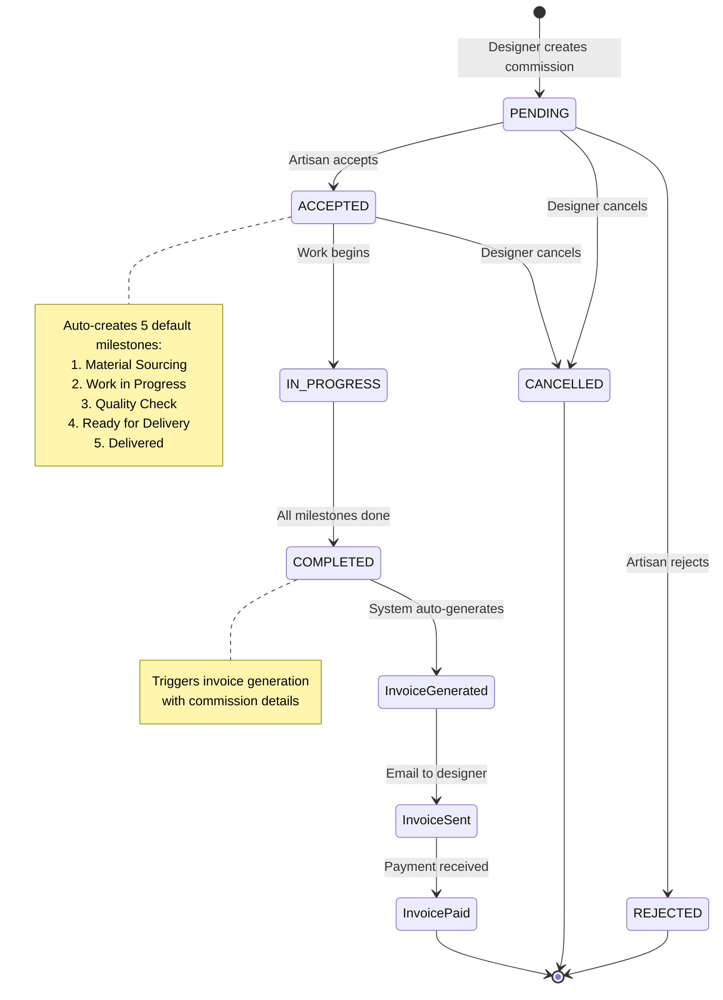
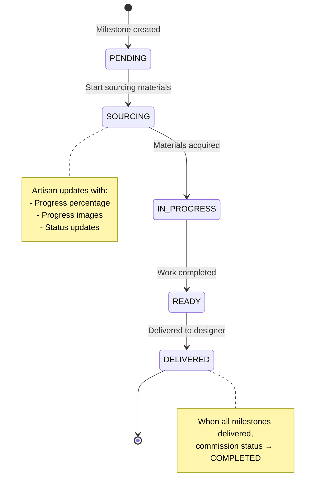
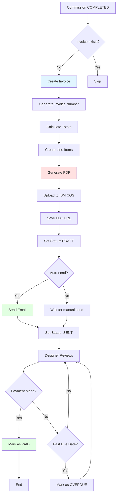
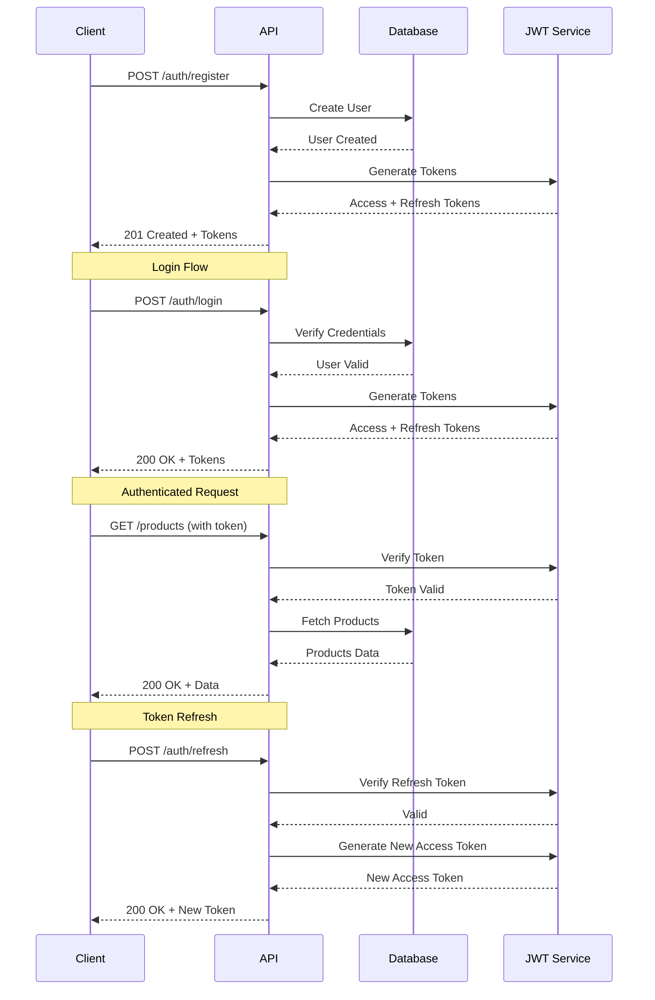
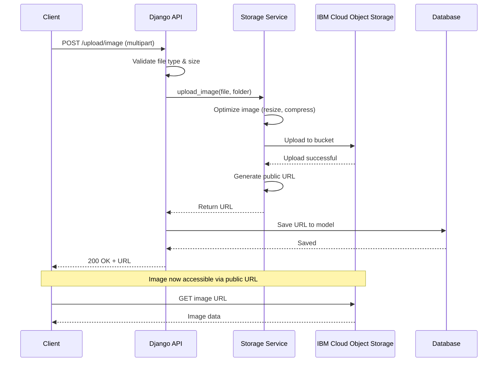

# CraftersLink - Database Schema Diagram

## Entity Relationship Diagram

```mermaid
erDiagram
    User ||--o| ArtisanProfile : "has (if artisan)"
    User ||--o{ Commission : "creates (as designer)"
    ArtisanProfile ||--o{ Product : "creates"
    ArtisanProfile ||--o{ Commission : "receives"
    Product ||--o{ Commission : "references"
    Commission ||--|| Invoice : "generates"
    Commission ||--o{ Milestone : "tracks"

    User {
        int id PK
        string username UK "Unique username"
        string email UK "Unique email"
        string password "Hashed password"
        string first_name
        string last_name
        string role "ARTISAN or DESIGNER"
        string phone_number "Kenyan format"
        string profile_image "IBM COS URL"
        boolean is_verified "Email verified"
        boolean is_active "Account active"
        datetime date_joined
        datetime created_at
        datetime updated_at
    }

    ArtisanProfile {
        int id PK
        int user_id FK "One-to-one with User"
        text bio "Max 1000 chars"
        string county "47 Kenyan counties"
        string town
        string craft_specialty "Craft type"
        int years_of_experience
        string workshop_address
        string business_name
        string business_registration
        json portfolio_images "IBM COS URLs"
        decimal average_rating "0.00-5.00"
        int total_commissions "Completed count"
        datetime created_at
        datetime updated_at
    }

    Product {
        int id PK
        int artisan_id FK "Foreign key to ArtisanProfile"
        string name "Max 200 chars"
        text description
        string material "Primary material"
        decimal length_cm "Nullable"
        decimal width_cm "Nullable"
        decimal height_cm "Nullable"
        decimal weight_kg "Nullable"
        decimal price_kes "Price in KES"
        string status "IN_STOCK, COMMISSIONABLE, SOLD, ARCHIVED"
        string primary_image "IBM COS URL"
        json additional_images "IBM COS URLs"
        string craft_category
        json tags "Search tags"
        int views_count "View counter"
        int commission_count "Times commissioned"
        datetime created_at
        datetime updated_at
    }

    Commission {
        int id PK
        int designer_id FK "Foreign key to User"
        int artisan_id FK "Foreign key to ArtisanProfile"
        int reference_product_id FK "Optional reference"
        string title "Max 200 chars"
        text custom_brief "Requirements"
        decimal budget_kes "Budget in KES"
        date requested_delivery_date
        date agreed_delivery_date "Nullable"
        date actual_delivery_date "Nullable"
        string status "PENDING, ACCEPTED, REJECTED, IN_PROGRESS, COMPLETED, CANCELLED"
        json attachment_urls "IBM COS URLs"
        text notes
        datetime created_at
        datetime updated_at
    }

    Milestone {
        int id PK
        int commission_id FK "Foreign key to Commission"
        string name "Max 100 chars"
        text description
        string status "PENDING, SOURCING, IN_PROGRESS, READY, DELIVERED"
        int progress_percentage "0-100"
        json progress_images "IBM COS URLs"
        date expected_completion "Nullable"
        datetime actual_completion "Nullable"
        int order "Display order"
        datetime created_at
        datetime updated_at
    }

    Invoice {
        int id PK
        int commission_id FK "One-to-one with Commission"
        string invoice_number UK "INV-YYYY-NNNN"
        date issue_date
        date due_date
        decimal subtotal_kes "Before tax"
        decimal tax_percentage "VAT percentage"
        decimal tax_amount_kes "Calculated tax"
        decimal total_kes "Total amount"
        string status "DRAFT, SENT, PAID, OVERDUE, CANCELLED"
        json line_items "Invoice items"
        string payment_method "Nullable"
        string payment_reference "Nullable"
        datetime paid_date "Nullable"
        string pdf_url "IBM COS URL"
        text notes
        text terms_and_conditions
        datetime created_at
        datetime updated_at
    }
```



---

## Commission Workflow State Diagram



---

## Milestone Progress Flow



---

## Invoice Generation Flow



---

## User Authentication Flow



---

## File Upload Flow



---

## Database Indexes Strategy

### Primary Indexes (Automatic)
- All `id` fields (Primary Keys)
- All Foreign Key fields

### Custom Composite Indexes

**User Model:**
```sql
CREATE INDEX idx_user_role_verified ON users(role, is_verified);
CREATE INDEX idx_user_email ON users(email);
```

**ArtisanProfile Model:**
```sql
CREATE INDEX idx_artisan_county_craft ON artisan_profiles(county, craft_specialty);
CREATE INDEX idx_artisan_rating ON artisan_profiles(average_rating);
```

**Product Model:**
```sql
CREATE INDEX idx_product_status_category ON products(status, craft_category);
CREATE INDEX idx_product_material ON products(material);
CREATE INDEX idx_product_price ON products(price_kes);
CREATE INDEX idx_product_created ON products(created_at DESC);
```

**Commission Model:**
```sql
CREATE INDEX idx_commission_designer_status ON commissions(designer_id, status);
CREATE INDEX idx_commission_artisan_status ON commissions(artisan_id, status);
CREATE INDEX idx_commission_status_created ON commissions(status, created_at DESC);
```

**Milestone Model:**
```sql
CREATE INDEX idx_milestone_commission_status ON milestones(commission_id, status);
CREATE INDEX idx_milestone_order ON milestones(commission_id, order);
```

**Invoice Model:**
```sql
CREATE INDEX idx_invoice_number ON invoices(invoice_number);
CREATE INDEX idx_invoice_status_due ON invoices(status, due_date);
```

---

## Query Optimization Examples

### Efficient Product Listing
```python
# Bad: N+1 queries
products = Product.objects.all()
for product in products:
    print(product.artisan.business_name)  # Extra query per product

# Good: Use select_related
products = Product.objects.select_related('artisan', 'artisan__user').all()
for product in products:
    print(product.artisan.business_name)  # No extra queries
```

### Efficient Commission Details
```python
# Good: Prefetch related milestones
commission = Commission.objects.select_related(
    'designer',
    'artisan',
    'artisan__user',
    'reference_product'
).prefetch_related(
    'milestones'
).get(id=commission_id)
```

### Filtered Product Search
```python
# Leverages composite index on (status, craft_category)
products = Product.objects.filter(
    status='COMMISSIONABLE',
    craft_category='SOAPSTONE',
    price_kes__gte=5000,
    price_kes__lte=20000
).select_related('artisan').order_by('-created_at')
```

---

## Data Integrity Constraints

### Foreign Key Constraints
```sql
-- Cascade delete for dependent data
ALTER TABLE artisan_profiles 
    ADD CONSTRAINT fk_artisan_user 
    FOREIGN KEY (user_id) REFERENCES users(id) 
    ON DELETE CASCADE;

ALTER TABLE products 
    ADD CONSTRAINT fk_product_artisan 
    FOREIGN KEY (artisan_id) REFERENCES artisan_profiles(id) 
    ON DELETE CASCADE;

ALTER TABLE commissions 
    ADD CONSTRAINT fk_commission_designer 
    FOREIGN KEY (designer_id) REFERENCES users(id) 
    ON DELETE CASCADE;

-- Set null for optional references
ALTER TABLE commissions 
    ADD CONSTRAINT fk_commission_product 
    FOREIGN KEY (reference_product_id) REFERENCES products(id) 
    ON DELETE SET NULL;
```

### Check Constraints
```sql
-- Price validations
ALTER TABLE products 
    ADD CONSTRAINT chk_product_price 
    CHECK (price_kes > 0);

ALTER TABLE commissions 
    ADD CONSTRAINT chk_commission_budget 
    CHECK (budget_kes > 0);

-- Percentage validations
ALTER TABLE milestones 
    ADD CONSTRAINT chk_milestone_progress 
    CHECK (progress_percentage >= 0 AND progress_percentage <= 100);

ALTER TABLE artisan_profiles 
    ADD CONSTRAINT chk_artisan_rating 
    CHECK (average_rating >= 0 AND average_rating <= 5);

-- Date validations
ALTER TABLE invoices 
    ADD CONSTRAINT chk_invoice_dates 
    CHECK (due_date >= issue_date);
```

---

## Database Backup Strategy

### Backup Schedule
- **Hourly:** Transaction log backup
- **Daily:** Full database backup (retained for 7 days)
- **Weekly:** Full backup (retained for 4 weeks)
- **Monthly:** Full backup (retained for 12 months)

### Backup Commands
```bash
# Full backup
pg_dump -U postgres -d crafterslink > backup_$(date +%Y%m%d_%H%M%S).sql

# Compressed backup
pg_dump -U postgres -d crafterslink | gzip > backup_$(date +%Y%m%d_%H%M%S).sql.gz

# Restore
psql -U postgres -d crafterslink < backup_20260502_120000.sql
```

---

## Performance Monitoring Queries

### Slow Query Detection
```sql
-- Enable slow query logging
ALTER SYSTEM SET log_min_duration_statement = 1000; -- Log queries > 1s

-- Find slow queries
SELECT query, calls, total_time, mean_time
FROM pg_stat_statements
ORDER BY mean_time DESC
LIMIT 10;
```

### Index Usage Analysis
```sql
-- Find unused indexes
SELECT schemaname, tablename, indexname, idx_scan
FROM pg_stat_user_indexes
WHERE idx_scan = 0
ORDER BY schemaname, tablename;

-- Find missing indexes
SELECT schemaname, tablename, seq_scan, seq_tup_read
FROM pg_stat_user_tables
WHERE seq_scan > 1000
ORDER BY seq_tup_read DESC;
```

---

This database schema documentation provides a comprehensive view of the CraftersLink data architecture, relationships, and optimization strategies.